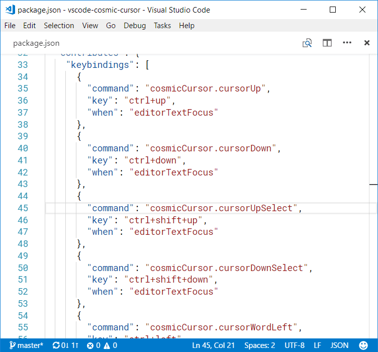

# Cosmic Cursor

**Cosmic Cursor** is a **VS Code** extension that overrides cursor-moving keyboard shortcuts.

## Basic usage

As soon as **Cosmic Cursor** is installed, the extension overrides the following keybindings:

- `ctrl+up` and `ctrl+down` - move cursor up/down by 3 character-containing lines. This skips empty lines and lines that contain only [non-word characters](https://www.w3schools.com/Jsref/jsref_regexp_wordchar_non.asp).

	

- `ctrl+shift+up` - select the current word if nothing is selected, or expand the selection. For a JavaScript/TypeScript/JSON file, the selection expands grammatically.
- `ctrl+shift+down` - reduce the selection made by `ctrl+shift+up`.

	

- `ctrl+left` and `ctrl+right` - move cursor left/right by one word. This is different from the built-in `cursorWordStartLeft` and `cursorWordEndRight` commands because this considers _camelCase_ as two words and skips non-word characters.

	

- `ctrl+shift+left` and `ctrl+shift+right` - similar to `ctrl+left`/`ctrl+right`, but this expands the selection instead of moving the cursor.

- `shift+backspace` - delete the whole text on the left of the cursor.

	
