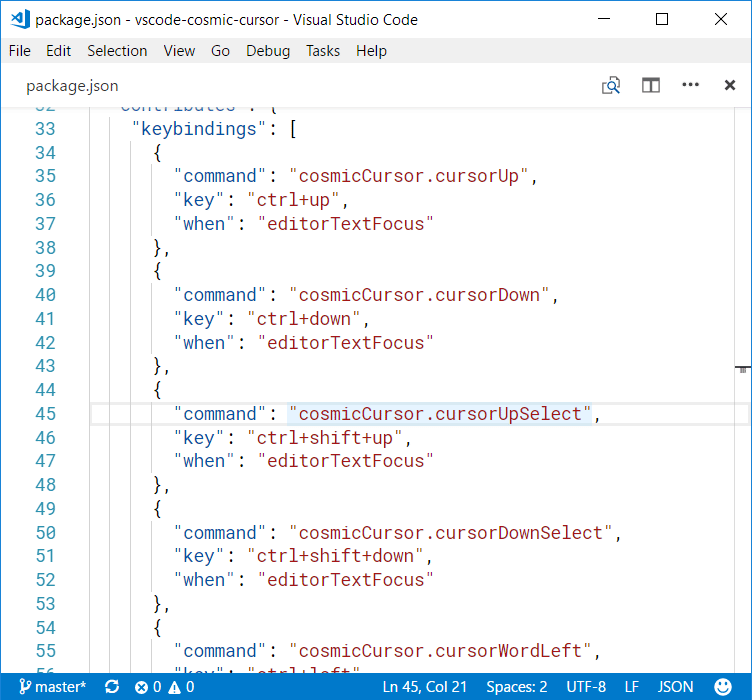

# Cosmic Cursor

**Cosmic Cursor** is a Visual Studio Code extension that overrides some cursor-moving keyboard shortcuts.

## Basic usage

As soon as **Cosmic Cursor** is installed, the extension overrides the following keybindings:

- `ctrl+up` and `ctrl+down` - move cursor up/down by 3 character-containing lines. This skips empty lines and lines that contain only [non-word characters](https://www.w3schools.com/Jsref/jsref_regexp_wordchar_non.asp).

	

- `ctrl+shift+up` - select like the built-in `editor.action.smartSelect.grow` command, but better with JavaScript/TypeScript/JSON/React files. For example, the selection makes in React `
...
` expand gradually.
- `ctrl+shift+down` - reduce the selection made by `ctrl+shift+up`.

	

- `ctrl+left` and `ctrl+right` - move cursor left/right by one word. This is different from the built-in `cursorWordStartLeft` and `cursorWordEndRight` commands because this considers _camelCase_ as two words and skips non-word characters.

	

- `ctrl+shift+left` and `ctrl+shift+right` - similar to `ctrl+left`/`ctrl+right`, but this expands the selection instead of moving the cursor.

- `deleteLeft` - delete the character on the left of the cursor. If the cursor is in front of the first non-white-space character of the line, this will also delete the white-space characters till the beginning of the line.

- `deleteRight` - delete the character on the right of the cursor. If the cursor is at the end of the line, this will also delete the white-space characters at the beginning of the next line; leaving only zero or one white-space as a bumper.

